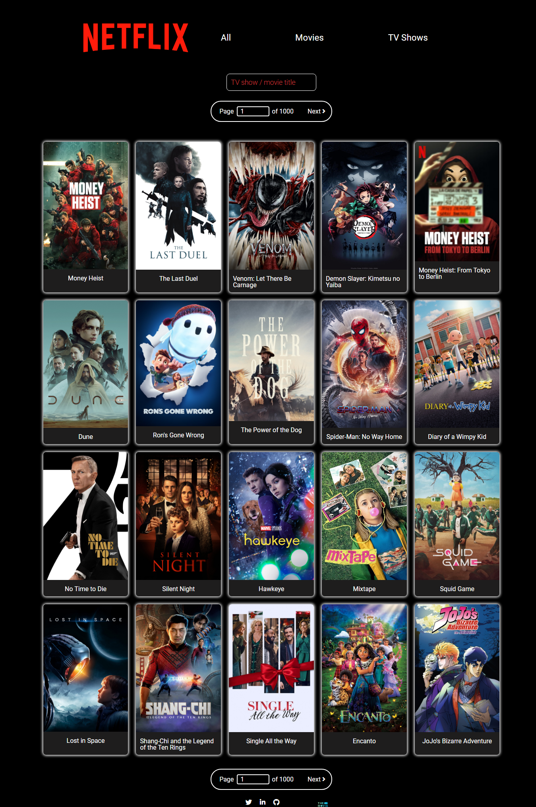
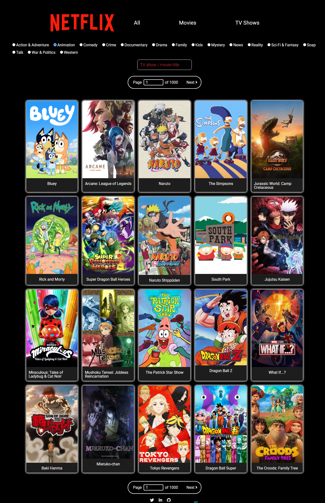
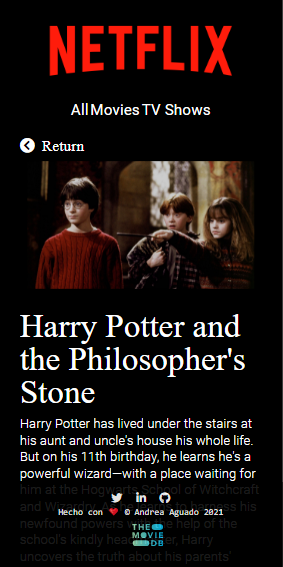
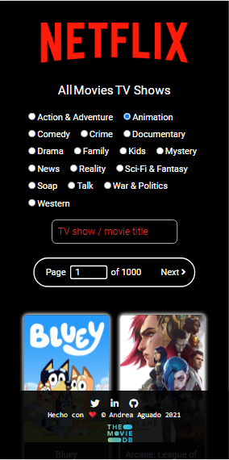

# Netflix-like page to show a catalog of movies and TV shows using React

This repository is conformed by:

- The files that are loose in the repository root, such as _package.json_ are used in the configuration of the project. In this case, the _package.json_ file was modified to be able to upload the project to _Github pages_.
- The `src/` folder: are the files of the web page such as **HTML, CSS, and the React Components and Services...**
- The `public/` and `docs/` folders.

## Page

| Homepage                                                                                                                                                                                                                                          | Filter by category                                                                                                                                                                                                                 | Detail                                                                                                                       | Responsive                                                                                                                       |
| ------------------------------------------------------------------------------------------------------------------------------------------------------------------------------------------------------------------------------------------------- | ---------------------------------------------------------------------------------------------------------------------------------------------------------------------------------------------------------------------------------- | ---------------------------------------------------------------------------------------------------------------------------- | -------------------------------------------------------------------------------------------------------------------------------- |
|                                                                                                                             |                                                                                                            |  |  |
| In the homepage you can see a display of trending media (obtained using [the movie database API](https://www.themoviedb.org/)). You can navigate through the different pages and in the search bar you can directly browse results by their title | After choosing between TV show or movies using the links located in the header you get to choose between different genres to filter. In addition you could also filter by title. By now this function is limited to just one page. | By clicking any show/movie you can see some additional info such as the overview.                                            | All the pages were modeled responsively.                                                                                         |

Hope you like my page, to see the final result visit [my github pages](https://andreaaguado.github.io/netflix/) 🤗

## Quick Start Guide

> **NOTE:** You need to have [Node JS](https://nodejs.org/) installed to work with this page:

### Steps to follow every time we want to start a project from scratch:

1. **Create your own repository**.
1. Download this **Starter kit from GitHub**.
1. **Copy all the files** from this Starter kit to the root folder of your repository.
1. **Open a terminal** in the root folder of your repository.
1. **Install the local dependencies** by running in the terminal the command:

```bash
npm install
```

### Steps to start the project:

```bash
npm start
```
